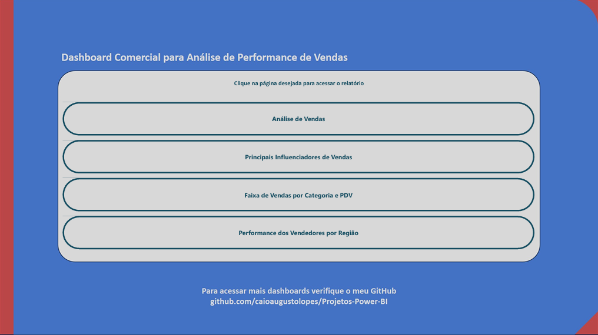

# 📊 Análise Comercial de Vendas – Power BI

Projeto de Business Intelligence focado na análise de vendas, identificação de padrões comerciais e avaliação de desempenho de produtos, vendedores e pontos de venda (PDVs).

O dashboard foi desenvolvido para transformar dados comerciais em insights estratégicos que auxiliam na tomada de decisão e na identificação de oportunidades de crescimento.

---

## 🎯 Objetivos do Projeto

- Analisar o desempenho de vendas por categoria de produto
- Identificar os principais fabricantes em volume de vendas
- Avaliar fatores que influenciam o aumento do valor das vendas
- Comparar a performance de diferentes pontos de venda (PDVs)
- Monitorar o desempenho de vendedores por região

---

## 📌 Visões do Dashboard

### Índice

### 📈 Visão Geral de Vendas

Apresenta uma visão consolidada do desempenho comercial:

- Distribuição de vendas por segmento (Doméstico, Corporativo e Industrial)
- Volume de vendas por categoria de produto
- Comparação de fabricantes com maior faturamento
- Identificação dos principais responsáveis pelo resultado comercial

  

---

### 🧠 Análise de Influenciadores de Vendas

Utilizando o visual de **Principais Influenciadores**, o dashboard identifica quais variáveis aumentam o valor médio das vendas.

Exemplo de insights encontrados:

- Segmentos corporativos tendem a gerar maior valor médio de venda
- A categoria **Celulares** possui forte impacto no aumento do ticket médio

Essa análise permite compreender quais fatores impulsionam melhores resultados comerciais.

---

### 🏬 Comparação de PDVs por Categoria

Análise do desempenho de diferentes lojas:

- Comparação do valor total vendido por categoria
- Identificação de diferenças de performance entre PDVs
- Visualização de oportunidades de melhoria em determinadas lojas

---

### 👨‍💼 Performance de Vendedores

Mapa interativo mostrando:

- desempenho de vendedores por região
- distribuição geográfica das vendas
- identificação de áreas com maior potencial comercial

---

## 🛠 Tecnologias Utilizadas

- Power BI
- DAX para criação de medidas e KPIs
- Modelagem de Dados
- Power Query para transformação de dados
- Visualizações analíticas para suporte à tomada de decisão

---

## 📊 Principais Insights

- Fabricantes como **Brastemp** concentram grande volume de vendas no período analisado.
- O segmento **corporativo** apresenta maior valor médio de vendas.
- Categorias como **celulares e eletrodomésticos** possuem forte impacto no faturamento total.
- Há variação significativa de desempenho entre diferentes PDVs.

---

## 🎯 Objetivo Profissional

Este projeto faz parte do meu portfólio de Business Intelligence, com foco no desenvolvimento de dashboards analíticos que apoiem decisões estratégicas baseadas em dados.
