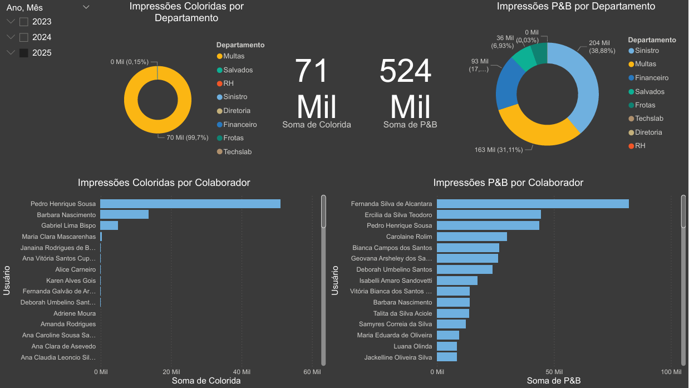
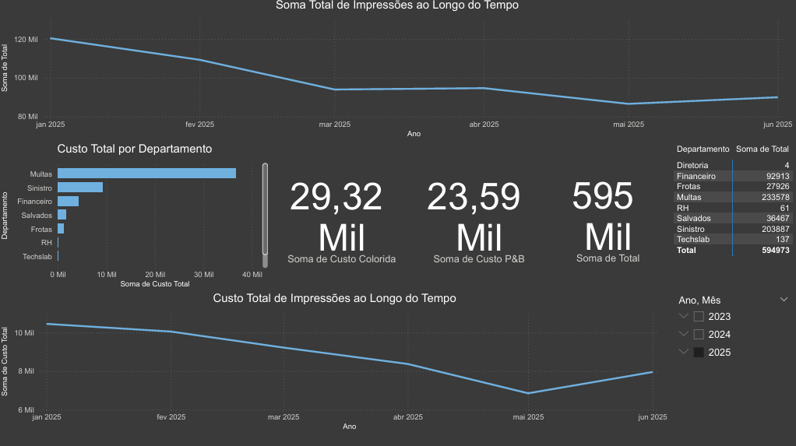

# 📊 Dashboard de KPI – Controle de Impressão

## 🎯 Objetivo
Analisar a performance operacional do setor de impressão, monitorando volume e eficiência.

## 📈 Indicadores Desenvolvidos
- Total de impressões por período
- Volume por setor
- Tendência mensal
- Indicadores de eficiência

## 🛠 Tecnologias Utilizadas
- Power BI
- DAX
- Modelagem de Dados
- Power Query

## 🖼 Visual do Dashboard

##Visão Geral

## Visão Custo

## 💡 Insight
O dashboard permite identificar picos de consumo e oportunidades de otimização de custos.
