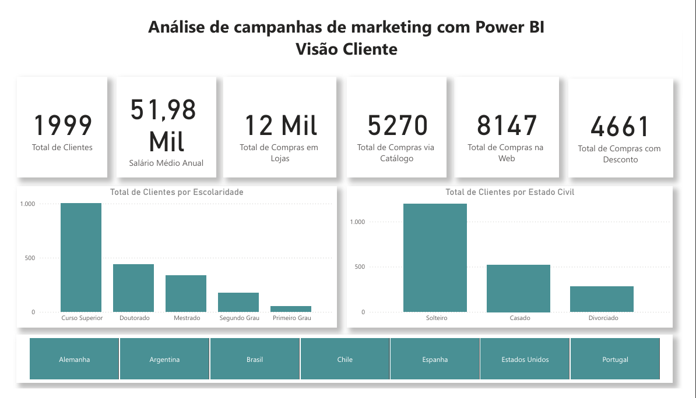
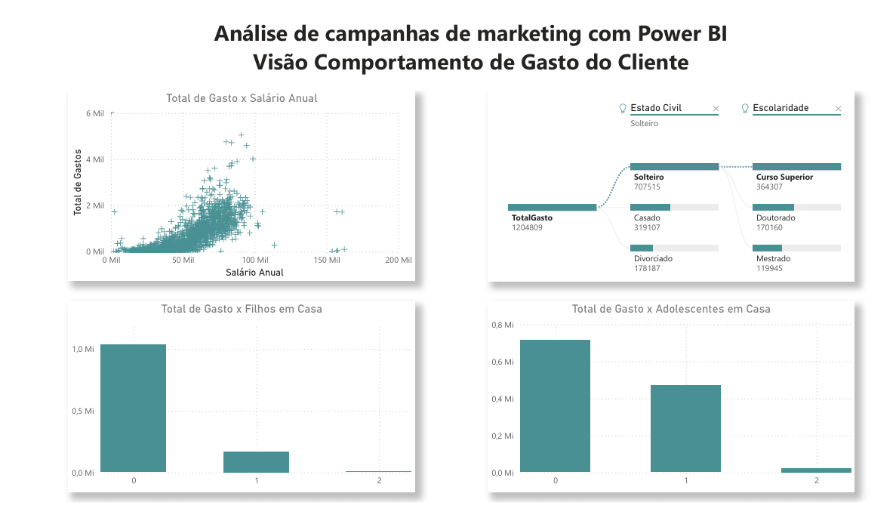
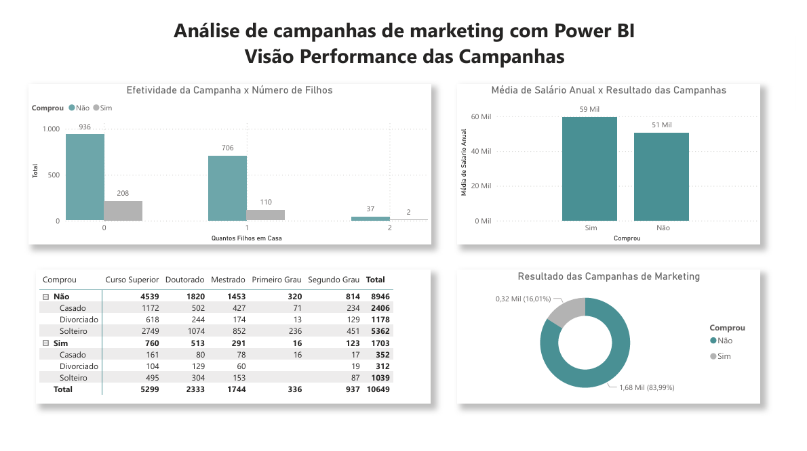
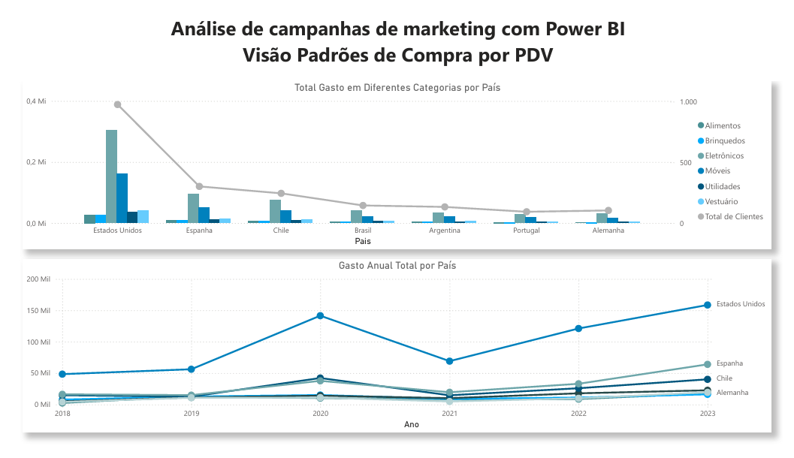

# 📊 Análise de Campanhas de Marketing – Power BI

Projeto de Business Intelligence focado na análise de campanhas de marketing, comportamento de clientes e padrões de compra por país e PDV.

O objetivo é transformar dados de clientes e campanhas em insights estratégicos para apoio à tomada de decisão.

---

## 🎯 Objetivos do Projeto

- Avaliar performance das campanhas de marketing
- Analisar perfil e comportamento dos clientes
- Identificar padrões de consumo por país
- Entender impacto de variáveis como renda, escolaridade e estado civil nas compras

---

## 📌 Visões do Dashboard

### 👤 1. Visão Cliente
Análise geral da base de clientes:
- Total de clientes
- Salário médio anual
- Total de compras por canal (Loja, Web, Catálogo)
- Compras com desconto
- Distribuição por escolaridade e estado civil
- Filtro por país

---

### 📈 2. Visão Comportamento do Cliente
Análise de padrões de consumo:
- Relação entre salário anual e total gasto
- Impacto do número de filhos no consumo
- Gasto por presença de adolescentes em casa
- Segmentação por estado civil e escolaridade

---

### 📣 3. Visão Performance das Campanhas
Avaliação da efetividade das campanhas:
- Taxa de conversão (Comprou x Não Comprou)
- Relação entre renda e resposta à campanha
- Distribuição por nível educacional
- Análise de perfil dos compradores

---

### 🏪 4. Visão Padrões de Compra por PDV
Análise comparativa entre países:
- Total gasto por categoria
- Evolução anual do gasto
- Volume de clientes por país
- Tendências de crescimento

---

## 🛠 Tecnologias Utilizadas

- Power BI
- DAX (criação de medidas e KPIs)
- Modelagem de Dados
- Power Query para tratamento e transformação

---

## 📊 Principais Insights

- Clientes com maior renda apresentam maior probabilidade de conversão.
- Países como Estados Unidos concentram maior volume de gasto.
- Compras com desconto representam parcela relevante do volume total.
- Variáveis demográficas influenciam diretamente o comportamento de consumo.

---

## 🖼 Visual do Projeto

### Visão Cliente

### Visão Comportamento

### Visão Campanhas

### Visão PDV

---

## 🎯 Objetivo Profissional

Projeto desenvolvido como parte do meu portfólio para atuação como Analista de Dados Júnior, com foco em Business Intelligence e análise estratégica de indicadores.
