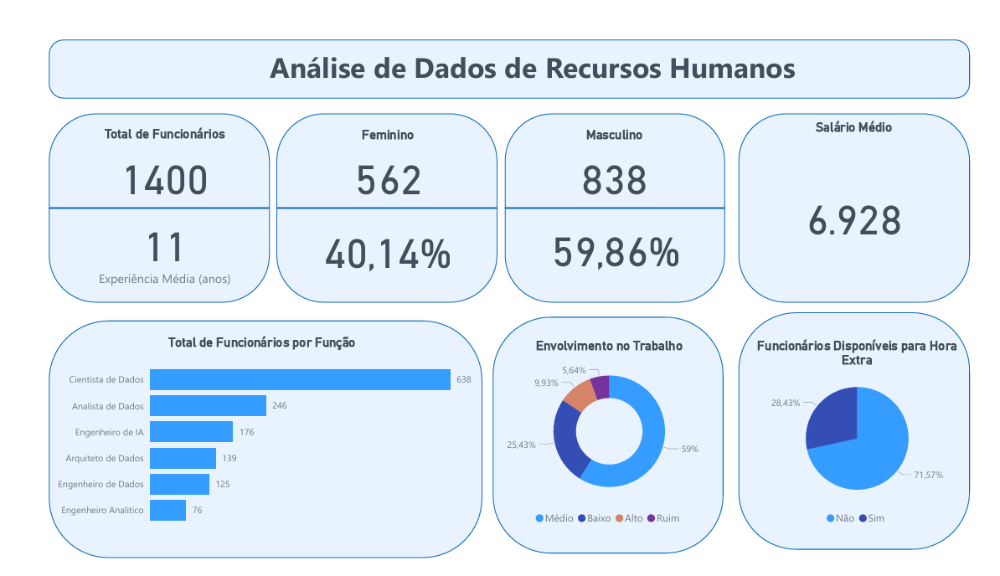

# 📊 Análise de Dados de Recursos Humanos – Power BI

Projeto de Business Intelligence focado na análise de dados de Recursos Humanos (RH), com o objetivo de transformar informações operacionais em indicadores estratégicos para apoio à gestão de pessoas.

O dashboard foi desenvolvido utilizando Power BI, com ênfase na criação de métricas e cálculos em DAX para monitoramento de indicadores de desempenho e características do quadro de funcionários.

---

## 🎯 Objetivos do Projeto

- Analisar o perfil geral dos colaboradores
- Monitorar indicadores de Recursos Humanos
- Avaliar distribuição de funcionários por função
- Identificar padrões relacionados à experiência e remuneração
- Utilizar cálculos em DAX para geração de métricas analíticas

---

## 📌 Visões do Dashboard

### 👥 Visão Geral de Funcionários

Apresenta os principais indicadores de Recursos Humanos:

- Total de funcionários
- Experiência média dos colaboradores
- Salário médio da organização
- Distribuição de funcionários por gênero
- Disponibilidade para realização de horas extras

Essa visão permite uma compreensão rápida do perfil da força de trabalho.

---

### 🧑‍💼 Distribuição de Funcionários por Função

Análise da composição da equipe por área de atuação:

- Cientista de Dados
- Analista de Dados
- Engenheiro de Dados
- Engenheiro de IA
- Arquiteto de Dados
- Engenheiro Analítico

Essa visualização facilita a identificação da estrutura organizacional e do volume de profissionais por especialidade.

---

### 📈 Indicadores de Engajamento e Disponibilidade

O dashboard apresenta métricas relacionadas ao comportamento e disponibilidade dos colaboradores:

- Nível de envolvimento no trabalho
- Percentual de funcionários disponíveis para hora extra
- Distribuição percentual por gênero

Esses indicadores são importantes para análise de produtividade e planejamento de recursos humanos.

---

## 🛠 Tecnologias Utilizadas

- Power BI
- DAX (Data Analysis Expressions)
- Modelagem de Dados
- Power Query
- Criação de KPIs e métricas analíticas
- Visualizações interativas

---

## 📊 Principais Métricas Criadas (DAX)

Alguns exemplos de cálculos desenvolvidos no projeto:

- Total de Funcionários
- Salário Médio
- Experiência Média
- Percentual de Funcionários por Gênero
- Percentual de Funcionários Promovidos
- Percentual de Funcionários Não Promovidos
- Total de Funcionários Disponíveis para Hora Extra

O uso de DAX permitiu a criação de indicadores dinâmicos para análise de dados de Recursos Humanos.

---

## 🎯 Objetivo Profissional

Este projeto faz parte do meu portfólio de análise de dados e Business Intelligence, com foco no desenvolvimento de dashboards que utilizam modelagem de dados e cálculos analíticos para gerar insights e apoiar decisões estratégicas.
